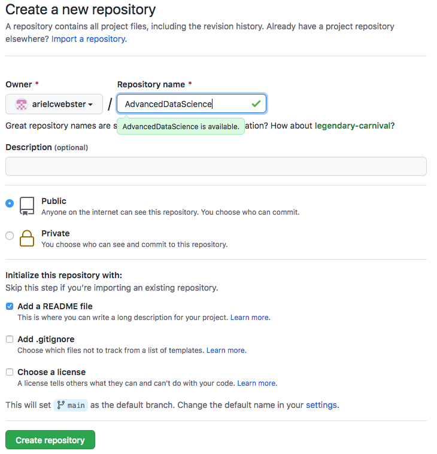
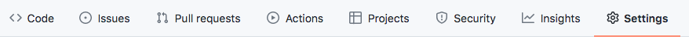
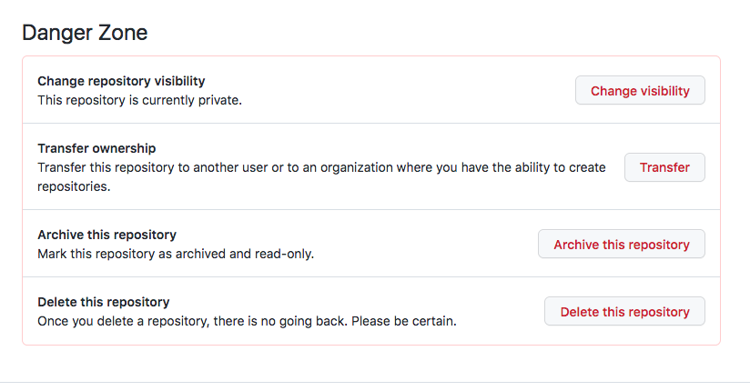
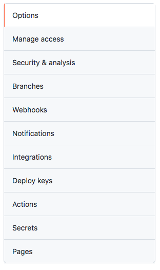
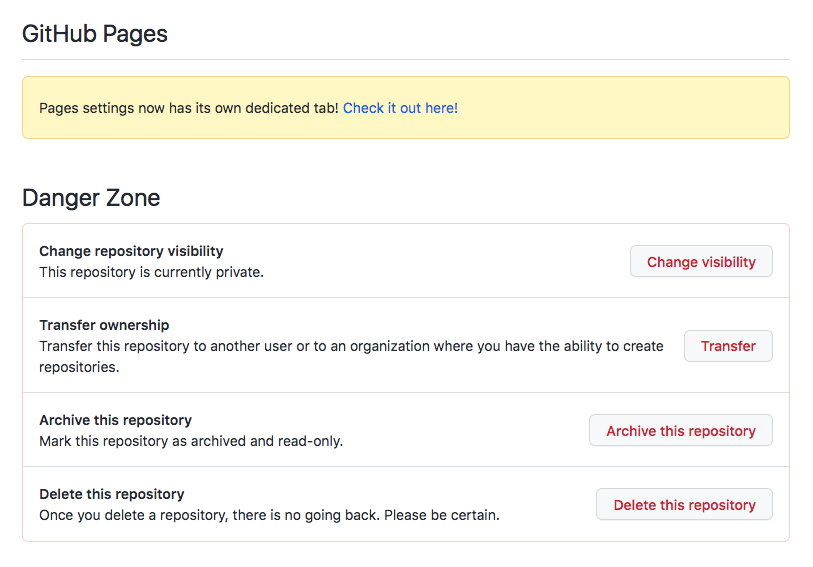
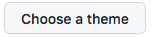
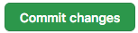
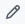

You have been asked to create a website to act as a quick tutorial for github. Github is ideal for creating websites because it is free and you can store code and data files that are easily referenced by in the outward facing websites you create. This example webpage should show you what I expect for the level of detail of your website, it should also help you put together the actual website itself. 

# How to Create a Github Website

## Step 1 - Account

Create a github account, if you don't already have one, by going to [this link](https://github.com/) and clicking the **Sign Up** button at the top right of the page. This should be free to do.

## Step 2 - Repository

Create a new repository for AdvancedDataScience.

<p align="center">
  
</p>

## Step 3 - Settings -> Danger Zone -> Public

If you made a private repository you will need to make it public. It is good to keep you repositories private until you are ready to show the world what you have been working on. If you would like to keep a private repository you can upgrade by paying about $5 a month (not recommended for this class). 

<p align="center">
  
</p>

Go to **Settings** at the top right of the page. Scroll down until you see **Danger Zone** then click on the button that says **Change Visibility** and make the repository **Public**. You will need to type or paste the name of your repository at the bottom of the window to confirm your decision. 

<p align="left">
  
</p>


## Step 4 - Settings -> Pages

If you skipped over **Step 3** because you already have a public repository go to **Settings** at the top right of the page. 

<p align="center">
  
</p>

Then click on the last item on the menu on the left of the screen, **Pages**.

<p align="left">
  
</p>

If you did follow **Step 3** you can get to pages slightly more quickly by clicking on the link directly above the Danger Zone section under GithubPages that says "Check it out here!"

<p align="left">
  
</p>

<p>Once on the <b>Pages</b> page click on the button marked  and have fun clicking through all the themes to figure out which one you like the most. Then click </p>


## Step 5 - index.md
This will bring you to an index.md file where you can create your website in the language Markdown. There will already be some instructions in the index.md file about how to use markdown (section headers, bolded words, etc.) 

### Images 
The main other thing you will need to know that is not included in this file is how to include images. You can either do this by writing `` The image that you want to display will need to be in the same folder as your index.md file on github for this to work. You can also put a path instead of just the filename. If you would like more control over how your images display you can insert html code directly into the markdown website either as stand alone images:

  ```
  <p align="left">
  
    
    
  </p>
  ```

or in the text `<p>text text  text text text</p>`

### Data
To link data to your code you can simply upload the data to github and then create a weblink to the data in your markdown file. 

### Published Website
<p>You can make changes to this file and then hit  at the bottom of the screen. You will then be able to view your website by going to https://YOURGITHUBUSERNAME.github.io/REPOSITORYNAME/ replacing the UPPER CASE portions of the URL with your github user name and the repository name for the website. If you would like to make further changes click the small pencil icon near the top right of the page. </p>


#### Note! 
I have not included two data sets for explanation here because doing so doesn't make as much sense when creating a website as it does with using a tool in excel. You *do* need to provide examples of how your tool is used on two datasets. 

